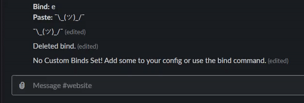

## Usage

Assumes prefix is `~`

| Command   | Description                               | Usage                    |
| :--: | :--: | :--: |
| bind add | Bind a message to a string/letter          | ~bind add "<trigger>" "<message>" |
| bind list | List all custom binds stored in config          | ~bind list |
| bind delete | Delete a bind given its index          | ~bind delete <index> |
| ps | Paste the message bound to given string          | ~ps "<trigger>"                  |

  
<h2 align="center">bind in Action!</h2> 

